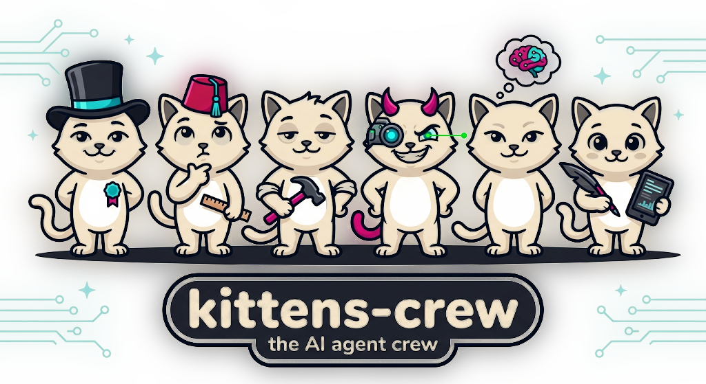
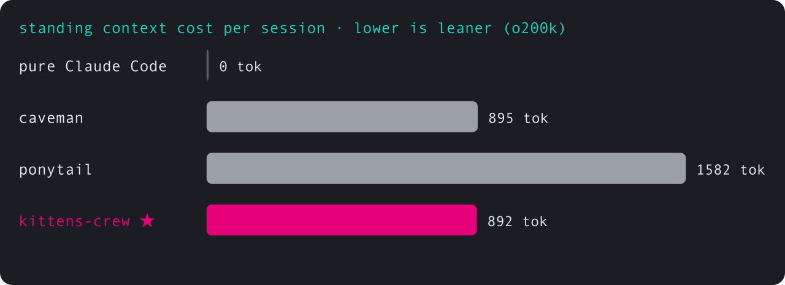
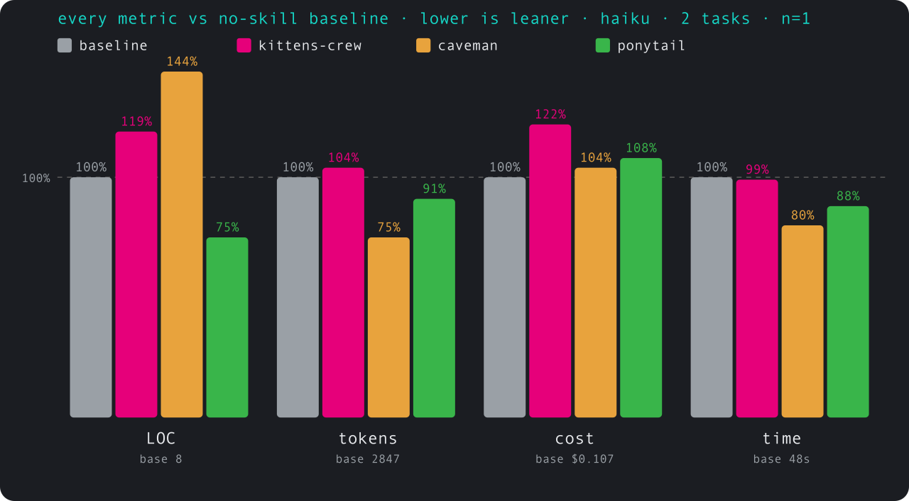

<p align="center">
  
</p>

<p align="center">
  <strong>spec-driven build pipeline with a lazy-senior quality reflex</strong><br/>
  <sub>one SPEC.md · a crew of kitties · no sub-agents · caveman-compressed</sub>
</p>

<p align="center">
  
  
  
  
</p>

---

## what this is

Two proven ideas, welded into one crew:

- **A durable spec** — `SPEC.md` at the repo root survives context resets. Tasks
  cite the invariants and interfaces they touch (`§T → §V, §I`), so the pipeline
  always knows what's done, what's pending, and what depends on what. Every bug
  becomes a `§B` record plus a `§V` invariant, so it can't come back. That last
  step is **backprop** — fix the code *and* edit the spec.
- **A laziness ladder** — before writing a line, climb the rungs and stop at the
  first that holds: YAGNI → reuse (DRY) → stdlib → native → installed dep → one
  line → minimum code. Shorter diffs, fewer dependencies, code that's easier to
  read and maintain.

**DRY is the hardest-enforced rule.** Grep before you write; two copies of a
rule is a latent 3am bug. DRY outranks YAGNI — YAGNI stops what isn't needed,
DRY stops what already exists.

## the crew

One main thread wearing six hats, so you always know which part of the crew is
talking. Each kitty prefixes its line with an emote and a name when it takes the
stage. Character is seasoning; the substance is identical with or without the hats.

| | kitty | role | voice |
|---|---|---|---|
| 🎩 | **Orchestrating** | routes work, writes the closing summary | calm, in charge |
| 📐 | **Planning** | owns `SPEC.md` | thoughtful, precise |
| 🔨 | **Builder** | climbs the ladder, ships the shortest diff | laid-back senior |
| 😼 | **Entropy** | hunts drift, bloat, duplication | the gleeful troublemaker |
| 🧠 | **Memory** | turns bugs into `§B` + `§V` | quiet, never forgets |
| 🖋️ | **Scribe** | human docs & comments (why, not what) | warm, plain-spoken |

See [`CAST.md`](./CAST.md). Drop the voices with "kitties quiet"; drop the whole
persona with "stop kitten".

## commands

The project is **kittens-crew** (plural, a crew of cats). The plugin id and the
command prefix are **`kitten`** (singular — you're addressing one cat).

**Core loop** — the everyday workflow:

| command | job |
|---|---|
| `/kitten:spec` | create / amend / backprop `SPEC.md`. Sole mutator. Ladders out speculative tasks (`∅`). |
| `/kitten:build` | plan → climb ladder → execute. Test per `§V`. Auto-backprops on failure. |
| `/kitten:check` | read-only **drift** report — `§V`/`§I`/`§T`: spec vs code. |
| `/kitten:install` | doctor — check the hooks are wired and rtk is ready. |
| `/kitten:help` | one-shot reference card. |

**Occasional** — deeper audits and housekeeping, not part of every loop:

| command | job |
|---|---|
| `/kitten:check-changed` | read-only **bloat** hunt on changed code (the review). |
| `/kitten:check-all` | read-only **bloat** hunt on the whole repo (the audit). |
| `/kitten:debt` | harvest every `// kitten:` shortcut into a debt ledger. **The crew proposes this automatically** every few completed tasks — you rarely run it by hand. |

A runtime-free `SessionStart` hook keeps the crew persona always-on.

## benchmarks

Real, reproducible, auto-generated — no fabricated numbers. Re-run anytime and it
rewrites this section and the chart:

```bash
cd benchmarks && bun install && bun bench
```

Worth noting from the numbers below: kittens-crew's standing context cost is
**lower than caveman's or ponytail's** while carrying a whole spec pipeline, not
just a single skill.

<!-- BENCH:START -->
<!-- generated by `bun bench` — do not edit by hand -->

<p align="center"></p>

**Standing context cost** — what each tool injects into context every session
(lower = leaner; measured from each tool's real instruction file). kittens-crew
carries a whole spec pipeline yet stays leaner than caveman or ponytail:

| tool | tokens / session |
|---|---:|
| pure Claude Code | 0 |
| caveman (compress skill) | 895 |
| ponytail (full ruleset) | 1582 |
| kittens-crew (persona) | 892 |

**Spec compression** — the same spec, two encodings (tokenizer `o200k_base`):

| encoding | tokens | chars | lines |
|---|---:|---:|---:|
| prose PRD | 596 | 2654 | 60 |
| **caveman SPEC.md** | **279** | 725 | 32 |

**53% fewer tokens for the same spec**, and the spec reloads on every command — the saving recurs each call.

_Cross-tool rows need that plugin installed locally to measure. Token-per-task pass-rate comparisons need real model runs — method in [`benchmarks/`](./benchmarks/), not faked._
<!-- BENCH:END -->

### Numbers — a real agent doing real work

The honest measurement: a headless Claude Code agent editing a real repo, scored
on the `git diff` it leaves, with each arm's **global plugins, skills and hooks
stripped per run** so it sees only the one skill. Harness in
[`benchmarks/agentic/`](./benchmarks/agentic/) (`bun bench:agentic`).

<!-- AGENTIC:START -->
<!-- generated by `bun bench:agentic` then `bun chart.ts` — do not edit by hand -->

A real headless Claude Code agent editing [slugify](https://github.com/sindresorhus/slugify), scored on the `git diff` it leaves. Same agent, same 2 tasks, with vs without each skill injected — **the agent's global plugins, skills and hooks are stripped per run**, so each arm sees only the one skill. haiku, n=1.

<p align="center"></p>

| vs no-skill baseline | LOC | tokens | cost | time |
|---|---:|---:|---:|---:|
| **kittens-crew** | +19% | +4% | +22% | −1% |
| **caveman** | +44% | −25% | +4% | −20% |
| **ponytail** | −25% | −9% | +8% | −12% |

**Reading it honestly:** this is two small one-off edits to a tiny repo — exactly the case a spec pipeline does NOT help with, and it shows. On this workload the pure-brevity skills (ponytail on LOC, caveman on tokens/time) lead; kittens-crew carries spec/ladder overhead that only pays off across many dependent tasks, which this bench doesn't exercise. Baseline means: LOC 8, tokens 2847, cost $0.107, time 48s. n=1 per cell over 2 tasks — high variance (LOC especially: the agent often makes zero edits). Directional, not a leaderboard. Re-run with more tasks and n via `bun bench:agentic`. We publish the unflattering run rather than fake a winning one.
<!-- AGENTIC:END -->

## format

See [`FORMAT.md`](./FORMAT.md). Sections: `§G` goal, `§C` constraints, `§I`
interfaces, `§V` invariants, `§T` tasks (status `.`/`~`/`x`/`∅`), `§B` bugs.
Caveman-encoded. Deliberate shortcuts in code carry `// kitten:` comments naming
their ceiling and upgrade path.

## install

### Claude Code

```bash
/plugin marketplace add mi4uu/kittens-crew
/plugin install kitten        # plugin id is "kitten" → /kitten: commands
```

The `SessionStart` hook auto-loads the crew persona in every project, and the
`/kitten:*` slash commands become available.

### Pi / opencode / other AGENTS.md agents

kittens-crew ships its persona as [`AGENTS.md`](./AGENTS.md) — the
[agents.md](https://agents.md) standard that Pi, opencode, and others read
automatically each session. Two ways in:

```bash
# point your agent at this repo, or drop the persona into your own project:
curl -fsSL https://raw.githubusercontent.com/mi4uu/kittens-crew/main/AGENTS.md >> AGENTS.md
```

Copy the `skills/` you want alongside it. Under Pi the crew behaviour and the
ladder come from `AGENTS.md`; you invoke the skills by name rather than via the
Claude-Code-only `/kitten:` slash commands.

## rtk (optional, recommended)

kittens-crew is built to burn few tokens; [rtk](https://github.com/rtk-ai/rtk)
("Rust Token Killer") goes further, compressing command output 60–90% before it
reaches context. It's a separate binary that owns its own Claude Code hook:

```bash
brew install rtk      # or: cargo install --git https://github.com/rtk-ai/rtk
rtk init -g           # installs the PreToolUse hook that routes bash through rtk
```

Once it's on PATH, the crew prefers rtk for verbose commands. One gap rtk warns
about: the native Read/Grep/Glob tools bypass its hook, so for big scans
(`/kitten:check-all`, `/kitten:debt`) the crew uses Bash + rtk. No rtk → plain
commands, no nagging. We deliberately don't bundle our own rtk hook — `rtk init
-g` already does it, and reimplementing it would just be duplication.

## non-goals

- No sub-agents for writes. Main Claude builds, edits, and writes the spec.
- No dashboards. `cat SPEC.md` is the dashboard.
- One thread, one spec, one diff. The only fan-out: read-only scouts on a repo
  too big for one pass (`/kitten:check-all`, `spec from-code`) — bounded,
  compressed, never writing. See [`CAST.md`](./CAST.md) SCOUTS.
- No JSON/YAML spec bodies. Markdown + pipe tables.

## thanks

kittens-crew stands on the shoulders of [**Julius Brussee**](https://github.com/JuliusBrussee).
His work — [cavekit](https://github.com/JuliusBrussee/cavekit) (the spec
pipeline), [caveman](https://github.com/JuliusBrussee/caveman) (token
compression), and [caveman-code](https://github.com/JuliusBrussee/caveman-code) —
was the inspiration and the base this is built on. The laziness ladder is owed to
[ponytail](https://github.com/DietrichGebert/ponytail). Thank you for the
groundwork.

## license

MIT.
